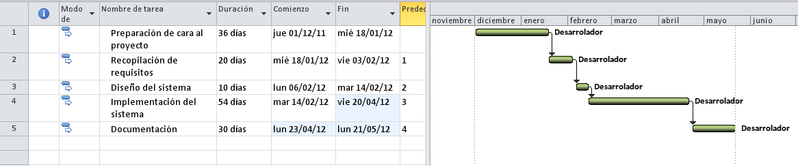
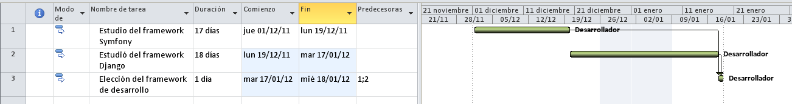
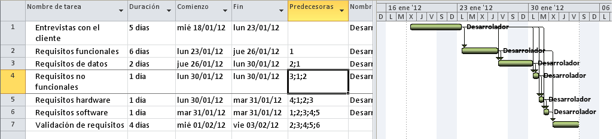
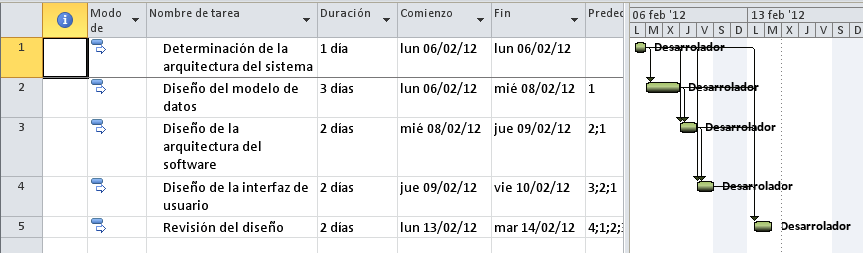
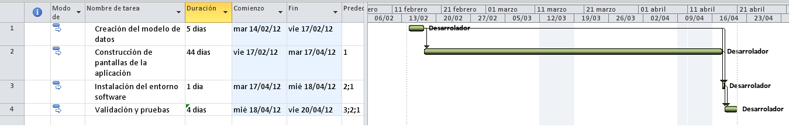

# Planificación # {#planificacion}

Este capítulo se divide en cuatro secciones. La primera se corresponde con la
estimación de recursos, tanto temporales como humanos, hardware y software
necesarios para la elaboración del proyecto. En la segunda de ellas se realiza
una planificación de tareas y temporal. Con las estimaciones realizadas en las
dos secciones anteriores, en la tercera sección se construye el cronograma del
proyecto. Finalmente, en la cuarta sección se describen el resto de tareas que
también será necesario realizar tras la primera fase del proyecto, es decir, las
referentes a la elaboración a la memoria técnica y la presentación del proyecto.

## Estimación de recursos ## {#recursos}

En esta sección se describen los recursos necesarios para la elaboración del
proyecto. Esto es, los recursos temporales, humanos, hardware y software.

### Estimación temporal ### {#temporal}

Para el desarrollo del proyecto se dispone de 750 horas para el desarrollo de
este proyecto divididas en 600 horas para el desarrollo y 150 para la realización
de la memoria y la presentación.

Las horas disponibles se corresponden con las horas disponibles de la beca de
colaboración junto con las correspondientes de la asignatura II31 - Sistemas
Informáticos. Respecto a la beca de colaboración define la dedicación de 15
horas semanales de diciembre hasta junio, es decir, equivale a un total de 450
horas de dedicación. Por otra parte se dispone de las horas correspondientes a
la asignatura que son un total de 300 horas, de las cuáles 150 son para el
desarrollo del proyecto y las otras 150 para el desarrollo de esta memoria y la
presentación.

### Recursos humanos ### {#humanos}

Para el desarrollo del proyecto se dispone de un solo desarrollador, esto implica
que es la misma persona quien realiza las tareas de dirección, desarrollo, diseño
y pruebas. El desarrollador del proyecto en este caso será el alumno que cuenta
en todo momento de la ayuda y supervisión de las tutoras del proyecto. Las
tutoras del proyecto en este caso actuarán a la vez como clientes del desarrollo.

### Recursos hardware y software ### {#hwsw}

Durante el desarrollo del proyecto se dispondrá de los siguientes recursos hardware:

* **Servidor del departamento**: Este servidor se encontrará en la red de la 
universidad y se utilizará cómo servidor de producción de la aplicación.
* **Ordenador del desarrollador**: El desarrollador dispondrá de un portátil
para realizar el desarrollo de la aplicación en él y realizar pruebas locales
sin afectar el funcionamiento de la aplicación.

Por lo que respecta al software disponible, la aplicación se realizará sobre el 
sistema operativo Ubuntu 11.10. Además el proyecto se ejecutará sobre Python 2.7.2
con la plataforma de desarrollo Django 1.3 instalada.

Para el desarrollo del proyecto, se ha utilizado *Eclipse* como editor de texto y *Git*
como software de control de versiones.

## Planificación de tareas y temporal ## {#tareasTemporal}

Esta sección consta de tres apartados diferentes. En el primero de ellos se
describen las actividades que es necesario realizar para la elaboración del
proyecto. A continuación, se detalla la secuenciación de las tareas definidas
anteriormente. Finalmente, se realiza una estimación de los tiempos necesarios
para ejecutar esas actividades.

### Lista de actividades ### {#actividades}

A continuación, se listarán y se describirán todas las actividades que se tienen
que realizar durante el desarrollo del proyecto. La jerarquía de todas estas 
actividades se puede observar en la figura 3.1.

**Preparación de cara al proyecto**: En este proceso se adquieren los conocimientos
previos necesarios para el desarrollo de la herramienta de evaluación.

* *Estudio del framework Symfony*: Para mejorar la decisión del
framework que se utilizará en el proyecto se considera estudiar los
conceptos que se utilizan en este framework para analizar las ventajas/
inconvenientes que aportan al desarrollo del proyecto.

* *Estudió del framework Django*: En la preparación del proyecto también
se considera estudiar los conceptos que utiliza Django igual como se ha
realizado para el framework del punto anterior.

* *Elección del framework de desarrollo*: En esta tarea se analizan los
conceptos aprendidos de los diferentes estudios junto con otras
características del entorno y se elige el framework que se utilizará
durante la fase de desarrollo.

**Recopilación de requisitos**: En la definición de requisitos se obtienen las
condiciones o características que tendrá que poseer la futura herramienta. Se
identifica cada una de las necesidades de los usuarios que hagan uso de la
aplicación.

* *Entrevistas con el cliente*: Las entrevistas se realizan para que el alumno
sepa las funcionalidades que debe cumplir la aplicación. En este
proyecto, las tutoras actuarán como cliente en estas entrevistas. De estas
entrevistas se obtiene la información necesaria para definir los requisitos
del sistema.

* *Requisitos funcionales*: Los requisitos funcionales engloban todos
aquellos objetivos que son de necesario cumplimiento para el correcto
funcionamiento de la aplicación.

* *Requisitos de datos*: Los requisitos de datos engloban toda la
información obtenida que formará parte de los datos del programa

* *Requisitos no funcionales*: Los requisitos no funcionales son aquellas
restricciones bajo las cuales debe funcionar el sistema.

* *Requisitos hardware*: Los requisitos hardware son aquellos que definen
la plataforma hardware necesaria para el funcionamiento del sistema.

* *Requisitos software*: Los requisitos software describen el software
necesario para el funcionamiento del sistema. Se trata de las aplicaciones
o condiciones que se necesitan para el desarrollo de la aplicación y su
posterior uso.

* *Validación de requisitos*: Se comprueba que los requisitos son
completos, correctos y consistentes, es decir, se comprueba si las
necesidades de los usuarios han quedado completamente reflejadas en
los requisitos.

**Diseño del sistema**: Esta actividad tiene como objetivo especificar los
componentes software y hardware del sistema, así como las relaciones
existentes entre ellos. En esta actividad, también se determina el diseño de la
interfaz de usuario.

* *Determinación de la arquitectura del sistema*: Se debe tener claro cómo
interactúan los diferentes elementos software y hardware implicados en
el desarrollo de la herramienta de evaluación.

* *Diseño del modelo de datos*: Se debe definir que objetos habrán en el 
sistema y cómo estarán relacionados entre si.

* *Diseño de la arquitectura del software*: Se debe estudiar que módulos
necesitará la aplicación y que datos contendrá cada módulo. Además se definirán
las funciones que contendrá cada módulo.

* *Diseño de la interfaz de usuario*: Las interfaces de usuario son el
mecanismo a través del cual los usuarios establecerán un diálogo con la
aplicación. Por lo que un buen diseño es un aspecto crucial para la
obtención de una buena aplicación final. Además si el usuario conoce ya
el diseño de otras aplicaciones le será mucho más fácil adaptarse a la
nueva herramienta. Partiendo de los requisitos iniciales, de la
información obtenida en las entrevistas y comparando con las
aplicaciones ya existentes en la universidad, se realizará una interfaz lo
más adecuada posible para el usuario final.

* *Revisión del diseño*: Se tiene que realizar una revisión del diseño en
busca de posibles fallos que hayan podido ocurrir o mejorar ciertos
aspectos del diseño.

**Implementación del sistema**: En esta fase se llevan a cabo todas las actividades
necesarias para obtener el software final, para lo cual se lleva a cabo el
desarrollo de la aplicación, así como las pruebas necesarias para asegurar su
correcto funcionamiento.

* *Creación del modelo de datos*: Esta actividad consiste en la creación del
modelo de datos de la aplicación, en el que quedarán reflejados los
requisitos de datos especificados en etapas anteriores.

* *Construcción de pantallas de la aplicación*: En esta actividad se
desarrollarán todos los elementos necesarios para satisfacer los
requisitos del sistema que se han detallado en etapas anteriores y para la 
construcción de los diferentes componentes software se seguirá la arquitectura 
software diseñada.

* *Instalación del entorno software*: Para esta actividad se configurará el
entorno hardware con el software para que se pueda ejecutar el proyecto
en él.

* *Validación y pruebas*: El objetivo de esta actividad es llevar a cabo un
conjunto de pruebas que permitan comprobar el correcto
funcionamiento de las distintas partes de la herramienta de evaluación
realizada.

### Secuenciación de actividades ### {#secuenciacion}

En este proceso se identifican y documentan las relaciones de dependencia entre las actividades
del proyecto identificadas en la sección anterior. También es tarea de este proceso identificar
las razones por las que se producen estas dependencias. En la siguiente tabla se listan las 
actividades que se deben llevar a cabo durante la ejecución del proyecto.

Aunque, debido a las dependencias existentes entre las actividades sería posible cierto paralelismo
en la ejecución de éstas, las tareas se llevarán a cabo de forma secuencial, debido a que sólo se
dispone de una persona para el desarrollo completo del proyecto.

| Número | Actividad                                      | Tareas precedentes |
| ------ | ---------------------------------------------- | ------------------ |
| 1      | **Preparación de cara al proyecto**            | -                  |
| 2      | *Estudio del framework Symfony*                | -                  |
| 3      | *Estudió del framework Django*                 | -                  |
| 4      | *Elección del framework de desarrollo*         | 2, 3               |
| 5      | **Recopilación de requisitos**                 | -                  |
| 6      | *Entrevistas con el cliente*                   | -                  |
| 7      | *Requisitos funcionales*                       | 6                  |
| 8      | *Requisitos de datos*                          | 6, 7               |
| 9      | *Requisitos no funcionales*                    | 6, 7, 8            |
| 10     | *Requisitos hardware*                          | 6, 7, 8, 9         |
| 11     | *Requisitos software*                          | 6, 7, 8, 9, 10     |
| 12     | *Validación de requisitos*                     | 7, 8, 9, 10, 11    |
| 13     | **Diseño del sistema**                         | 5                  |
| 14     | *Determinación de la arquitectura del sistema* | 12                 |
| 15     | *Diseño del modelo de datos*                   | 8, 12, 14          |
| 16     | *Diseño de la arquitectura del software*       | 7, 11, 12, 14, 15  |
| 17     | *Diseño de la interfaz de usuario*             | 7, 11, 12, 14, 16  |
| 18     | *Revisión del diseño*                          | 14, 15, 16, 17     |
| 19     | **Implementación del sistema**                 | 13                 |
| 20     | *Creación del modelo de datos*                 | 15, 18             |
| 21     | *Construcción de pantallas de la aplicación*   | 16, 17, 18         |
| 22     | *Instalación del entorno software*             | 21                 |
| 23     | *Validación y pruebas*                         | 22                 |

### Estimación de la duración de las actividades ### {#estimacion}

En este apartado se realiza una estimación de la duración que tendrá cada una de las tareas que
componen el proyecto. Las estimaciones se pueden observar en la siguiente tabla. 

Se calcula un total de 600 horas, el programador dedica 25 horas a la semana al desarrollo del
proyecto. Por tanto como un mes esta compuesto por 4 semanas, la duración total del proyecto sera de
6 meses.

| Actividad                                      | Duración |
| :--------------------------------------------- | -------: |
| **Preparación de cara al proyecto**            | 180 horas|
| *Estudio del framework Symfony*                |  85 horas|
| *Estudió del framework Django*                 |  90 horas|
| *Elección del framework de desarrollo*         |   5 horas|
| **Recopilación de requisitos**                 | 100 horas|
| *Entrevistas con el cliente*                   |  25 horas|
| *Requisitos funcionales*                       |  30 horas|
| *Requisitos de datos*                          |  10 horas|
| *Requisitos no funcionales*                    |   5 horas|
| *Requisitos hardware*                          |   5 horas|
| *Requisitos software*                          |   5 horas|
| *Validación de requisitos*                     |  20 horas|
| **Diseño del sistema**                         |  50 horas|
| *Determinación de la arquitectura del sistema* |   5 horas|
| *Diseño del modelo de datos*                   |  15 horas|
| *Diseño de la arquitectura del software*       |  10 horas|
| *Diseño de la interfaz de usuario*             |  20 horas|
| *Revisión del diseño*                          |  10 horas|
| **Implementación del sistema**                 | 270 horas|
| *Creación del modelo de datos*                 |  25 horas|
| *Construcción de pantallas de la aplicación*   | 220 horas|
| *Instalación del entorno software*             |   5 horas|
| *Validación y pruebas*                         |  20 horas|

## Desarrollo del cronograma ## {#cronograma}

También llamado Plan de tiempos, el cronograma analiza el secuenciamiento, las
estimaciones de duración y recursos necesarios para cada actividad. Con el
cronograma se determinará las fechas de inicio y fin del proyecto. La técnica
utilizada para el desarrollo del cronograma será el diagrama de Gantt, el cual se
muestra en la Figura 3.2 y sus actividades se descomponen en las siguientes figuras.

Se estima la fecha de inicio del proyecto el jueves 1 de diciembre de 2011, y la
fecha de fin de proyecto el viernes 21 de mayo de 2012. La duración total del
proyecto es de 150 días laborables.

Cabe destacar que, debido a los recursos humanos, aunque aparezca
paralelismo en las tareas al disponer de un solo desarrollador las tareas se
realizarán de forma totalmente secuencial.

## Resto de tareas vinculadas al proyecto ## {#restoTareas}

Como se comenta en la [estimación temporal](#temporal) el proyecto esta
compuesto por dos fases, el desarrollo y la documentación (realización de la
memoria y la presentación).

En este punto se definen las tareas que se realizaran en la fase de
documentación que comprende un total de 150 horas. De estas horas se
dedicarán 120 para la realización de la memoria y 30 para la realización de la
presentación.

El proceso de realización de la memoria esta compuesto por los siguientes
puntos:

1. *Documentación acerca la elaboración de una memoria técnica*: Esta tarea 
incluye la lectura de la normativa de la asignatura II31 para informarse acerca
de lo referente a la memoria y la presentación del proyecto. También incluirá 
la lectura del documento con la estructura de la memoria que especifica un 
posible esquema a seguir para la elaboración de memoria.

2. *Primera reunión con las directoras del proyecto*: Se lleva a cabo una
primera reunión entre las directoras del proyecto y el alumno, en la cual se
establecen las directrices a seguir en la redacción del documento.

3. *Redacción de la primera versión de la memoria*: Tras la primera reunión
se empieza con la redacción de la memoria. Una vez esté finalizada la
primera versión de la memoria técnica, ésta se entrega a las tutoras para
que sea revisada por éstas.

4. *Revisión de la memoria*: Se realiza una reunión para revisar el estado de
la memoria y comentar las posibles mejoras o cambios que las tutoras
crean necesario realizar.

5. *Corrección de la memoria*: Tras la revisión de la memoria se deben
realizar los cambios acordados durante la reunión.

6. *Subir la memoria al Aula Virtual*: Una vez el alumno y las tutoras
consideren que la memoria se encuentra en su versión definitiva, se
procede a subir el documento al Aula Virtual.

El procedimiento a seguir en la realización de la presentación se corresponde 
con los siguientes puntos:

1. *Presentación*: Se redacta la presentación de manera que sintetice todas
las tareas realizadas durante el proyecto.

2. *Revisión de la presentación*: Se realiza una revisión de la presentación
en busca de posibles cambios y mejoras. También se comprueba que el
tiempo necesario para la ejecución de la presentación no excede el
tiempo disponible.

3. *Diapositivas*: Una vez se disponga de la versión final de la presentación
se realiza una revisión de las diapositivas en busca de errores o aspectos
mejorables.

