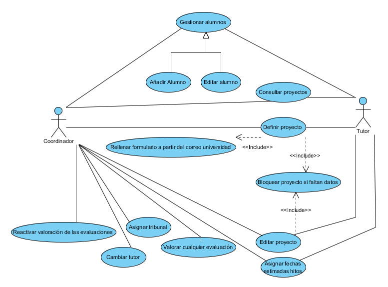
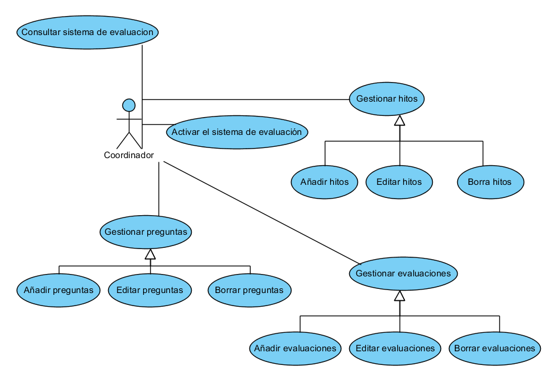

# Análisis del software # {#analisis}

En este capítulo se van a analizar las características que deberá tener la
aplicación. El análisis empezará describiendo los casos de uso de la aplicación
para después describir los requisitos que el software del sistema deberá 
cumplir. Un requisito de sistema es toda condición que éste debe cumplir o 
característica que debe tener para satisfacer un contrato, una norma o una 
especificación. Quedan diferenciados en diferentes tipos según el ámbito que 
comprenden. Los diferentes tipos en los que se pueden agrupar los requisitos son en 
requisitos funcionales, requisitos no funcionales, requisitos de datos, requisitos
hardware y requisitos software. Las siguientes secciones estarán relacionadas cada 
una con un tipo de requisito. Además cada sección definirá el tipo de requisito y 
listará los requisitos del tipo de la sección que debe cumplir el sistema.

## Casos de uso ## {#casosDeUso}

En esta sección se describirán los casos de uso de la aplicación que se realizará.
Los casos de uso describen los escenarios en los que se podrá utilizar la aplicación
y las acciones que se podrán realizar en cada uno de los escenarios.

Los diferentes casos de uso que se podrán encontrar en la aplicación serán la gestión 
de los cursos académicos, la gestión de los profesores, la gestión de los proyectos,
la gestión de los sistemas de evaluación y la gestión de las valoraciones.

Las figuras 4.1, 4.2, 4.3, 4.4 y 4.5 describen gráficamente los diferentes casos de uso.

## Requisitos funcionales ## {#funcionales}

Los requisitos funcionales son aquellas funciones que el sistema debe
proporcionar al usuario final. Estos requisitos han sido definidos de acuerdo a
una plantilla cuyos campos tienen el siguiente significado:

* *Código*: Valor alfanumérico que identifica de forma única cada requisito
funcional.
* *Nombre*: Nombre corto con el que se identifica cada requisito.
* *Versión*: Versión del requisito funcional.
* *Autores*: Nombre de la persona encargada de desarrollar el software del
sistema.
* *Fuentes*: Qué persona o condiciones han generado el requisito.
* *Requisitos asociados*: Código de los requisitos con los que está
relacionado.
* *Descripción*: Explicación detallada del significado del requisito.
* *Precondiciones*: Qué condiciones debe tener el sistema para que la
funcionalidad del requisito se pueda satisfacer.
* *Comentarios*: Cualquier información que sea útil añadir.

A continuación se describen todos los requisitos funcionales de la aplicación a
desarrollar agrupados en cinco grupos funcionales, estos grupos serán la
gestión de proyectos, la gestión de profesores, la gestión del sistema de
evaluación, la gestión de cursos y la gestión de las valoraciones.

### Gestión de los Proyectos ###
Esta funcionalidad representa todas las acciones que podrán realizar los
usuarios referente a los proyectos.

| |Definir el proyecto|
| ----- | ------ |
|Código|FRQ-01|
|Version|1.0|
|Nombre|Definir el proyecto|
|Autor|Luis Andreu Puchol|
|Fuentes|Ángeles López y María José Aramburu|
|Requisitos asociados|FRQ-02, DRQ-01|
|Descripción| El sistema debe permitir a un profesor definir la información relativa a un proyecto así como asignar un alumno al proyecto|

| |Rellenar el formulario del proyecto a partir del correo de asignación|
| ----- | ------ |
|Código|FRQ-02|
|Version|1.0|
|Nombre|Rellenar el formulario del proyecto a partir del correo de asignación|
|Autor|Luis Andreu Puchol|
|Fuentes|Ángeles López y María José Aramburu|
|Requisitos asociados|FRQ-01|
|Descripción|El sistema debe permitir a los profesores rellenar el formulario del proyecto a partir del correo que envía el E-UJIER a los profesores en la asignación de alumnos de practicas|
|Comentarios|Se realizará esta acción para que sea más cómodo para los tutores y además no se introduzcan errores en la información del proyecto|

| |Consultar proyectos|
| ----- | ------ |
|Código|FRQ-03|
|Nombre|Consultar proyectos |
|Version|1.0|
|Autor|Luis Andreu Puchol|
|Fuentes|Ángeles López y María José Aramburu|
|Requisitos asociados|DRQ-01|
|Descripción|El sistema para los tutores sólo debe mostrar una lista con todos los proyectos que tutorizen y para los coordinadores debe mostrar una lista con todos los proyectos del sistema. Además para cada proyecto mostrará el nombre del alumno, la empresa de estancia en prácticas, el título del proyecto y la fecha estimada de la etapa en la que esté el proyecto. Para el listado del coordinador también mostrará que tutor tutoriza el proyecto|
|Comentarios|Los parámetros de consulta serán el curso seleccionado y el profesor que tutoriza los proyectos. Además para el coordinador podrá mostrar todos los proyectos del curso seleccionado y añadirá a cada proyecto el tutor que tutoriza el proyecto|

| |Modificar la información del proyecto|
| ----- | ------ |
|Código|FRQ-04|
|Version|1.0|
|Nombre|Modificar la información del proyecto|
|Autor|Luis Andreu Puchol|
|Fuentes|Ángeles López y María José Aramburu|
|Requisitos asociados|DRQ-01|
|Descripción|El sistema debe permitir a los profesores modificar la información relativa al proyecto que tutorizan|

| |Gestionar el alumno del proyecto|
| ----- | ------ |
|Código|FRQ-05|
|Version|1.0|
|Nombre|Gestionar el alumno del proyecto|
|Autor|Luis Andreu Puchol|
|Fuentes|Ángeles López y María José Aramburu|
|Requisitos asociados|DRQ-05|
|Descripción|El sistema debe permitir a los profesores gestionar toda la información de un alumno necesaria para la aplicación. Esta acción incluirá la definición y la edición de los alumnos. La información que se necesitará de los alumnos será su nombre y apellidos junto con el usuario de la universidad para utilizar el sistema de autenticación de la universidad|

| |Gestión del estado de un proyecto|
| ----- | ------ |
|Código|FRQ-06|
|Version|1.0|
|Nombre|Bloquear el proyecto si faltan datos|
|Autor|Luis Andreu Puchol|
|Fuentes|Ángeles López y María José Aramburu|
|Descripción|El sistema debe cambiar el estado del proyecto a bloqueado si faltan datos para activar la siguiente evaluación. El sistema debe desbloquear el proyecto en cuanto los datos se hayan aportado|
|Comentarios|Se define esta acción para que al activar una evaluación no falte información que genere errores en la evaluación|

| |Cambiar el tutor del proyecto|
| ----- | ------ |
|Código|FRQ-07|
|Version|1.0|
|Nombre|Cambiar el tutor del proyecto|
|Autor|Luis Andreu Puchol|
|Fuentes|Ángeles López y María José Aramburu|
|Descripción|El sistema debe permitir que el coordinador cambie el tutor de un proyecto|
|Comentarios|Se necesita este requisito para que en el caso que se necesite cambiar el tutor de un proyecto esto se pueda realizar también en la aplicación|

| |Definir fechas estimadas de las evaluaciones de un proyecto|
| ----- | ------ |
|Código|FRQ-08|
|Version|1.0|
|Nombre|Definir fechas estimadas de las evaluaciones de un proyecto|
|Autor|Luis Andreu Puchol|
|Fuentes|Ángeles López y María José Aramburu|
|Requisitos asociados|DRQ-08|
|Descripción|El sistema debe permitir al profesor definir las estimaciones de cuándo deberán ser valoradas las evaluaciones de los proyectos|

| |Definir un tribunal para un proyecto|
| ----- | ------ |
|Código|FRQ-09|
|Version|1.0|
|Nombre|Definir un tribunal para un proyecto|
|Autor|Luis Andreu Puchol|
|Fuentes|Ángeles López y María José Aramburu|
|Requisitos asociados|DRQ-07|
|Descripción|El sistema debe permitir al coordinador definir un conjunto de profesores como tribunal del proyecto|

### Gestión de los Profesores ###
La funciones que comprenden este grupo serán todas aquellas referentes a los
profesores.

| |Definir profesor|
| ----- | ------ |
|Código|FRQ-10|
|Version|1.0|
|Nombre|Definir profesor|
|Autor|Luis Andreu Puchol|
|Fuentes|Ángeles López y María José Aramburu|
|Requisitos asociados|DRQ-04|
|Descripción|El sistema debe permitir definir toda la información de un profesor necesaria para la aplicación|

| |Consultar profesores|
| ----- | ------ |
|Código|FRQ-11|
|Version|1.0|
|Nombre|Consultar profesores|
|Autor|Luis Andreu Puchol|
|Fuentes|Ángeles López y María José Aramburu|
|Requisitos asociados|DRQ-04|
|Descripción|El sistema debe mostrar a los coordinadores una lista de todos los profesores que existan en la aplicación agrupados por el rol que ejerzan en la aplicación|

| |Modificar la información de un profesor|
| ----- | ------ |
|Código|FRQ-12|
|Version|1.0|
|Nombre|Modificar la información de un profesor|
|Autor|Luis Andreu Puchol|
|Fuentes|Ángeles López y María José Aramburu|
|Requisitos asociados|DRQ-04|
|Descripción|El sistema debe permitir al coordinador modificar la información de un profesor|

| |Cambiar el rol a un profesor|
| ----- | ------ |
|Código|FRQ-13|
|Version|1.0|
|Nombre|Cambiar el rol a un profesor|
|Autor|Luis Andreu Puchol|
|Fuentes|Ángeles López y María José Aramburu|
|Requisitos asociados|DRQ-04|
|Descripción|El sistema debe permitir al coordinador cambiar el rol de los profesores. De esta forma cambiar las acciones que un profesor pueda realizar|
|Comentarios|Debido a que un profesor podrá actuar de diferentes formas en la aplicación, el sistema debe permitir al coordinador que cambie su rol para cambiar su comportamiento en la aplicación|

### Gestión de los Sistemas de Evaluación ###
Las funciones que contendrá este bloque funcional serán todas aquellas que
atienden al sistema de evaluación.

| |Definir evaluaciones|
| ----- | ------ |
|Código|FRQ-14|
|Version|1.0|
|Nombre|Definir evaluaciones|
|Autor|Luis Andreu Puchol|
|Fuentes|Ángeles López y María José Aramburu|
|Requisitos asociados|FRQ-16, FRQ-17, DRQ-02|
|Descripción|El sistema debe permitir al coordinador definir las evaluaciones y toda su información relativa como son el porcentaje de la nota final y el responsable de ella|

| |Consultar el sistema de evaluación|
| ----- | ------ |
|Código|FRQ-15|
|Version|1.0|
|Nombre|Consultar el sistema de evaluación|
|Autor|Luis Andreu Puchol|
|Fuentes|Ángeles López y María José Aramburu|
|Requisitos asociados|DRQ-02|
|Descripción|El sistema debe mostrar el sistema de evaluación completo. Se mostrará para cada etapa de evaluación las evaluaciones que contiene junto con las preguntas de cada evaluación|

| |Editar evaluaciones|
| ----- | ------ |
|Código|FRQ-16|
|Version|1.0|
|Nombre|Editar evaluaciones|
|Autor|Luis Andreu Puchol|
|Fuentes|Ángeles López y María José Aramburu|
|Requisitos asociados|FRQ-14, FRQ-17, DRQ-02|
|Descripción|El sistema debe permitir al coordinador editar toda la información de las evaluaciones|
|Comentarios|Si se modifica alguna característica de una evaluación del sistema de evaluación, la aplicación debe permitir modificarla para que se conserven el conjunto de preguntas asociadas a la evaluación|

| |Eliminar evaluaciones|
| ----- | ------ |
|Código|FRQ-17|
|Version|1.0|
|Nombre|Eliminar evaluaciones|
|Autor|Luis Andreu Puchol|
|Fuentes|Ángeles López y María José Aramburu|
|Requisitos asociados|FRQ-14, FRQ-16, DRQ-02|
|Descripción|El sistema debe permitir al coordinador eliminar las evaluaciones|
|Comentarios|Si se considera que el sistema de evaluación ya no contiene una evaluación, el sistema debe permitir eliminarla|

| |Definir preguntas de las evaluaciones|
| ----- | ------ |
|Código|FRQ-18|
|Version|1.0|
|Nombre|Definir preguntas de las evaluaciones|
|Autor|Luis Andreu Puchol|
|Fuentes|Ángeles López y María José Aramburu|
|Requisitos asociados|FRQ-19, FRQ-20, DRQ-02|
|Descripción|El sistema debe permitir al coordinador definir las preguntas de las evaluaciones junto con el tipo de respuesta de cada pregunta|

| |Editar preguntas de las evaluaciones|
| ----- | ------ |
|Código|FRQ-19|
|Version|1.0|
|Nombre|Editar preguntas de las evaluaciones|
|Autor|Luis Andreu Puchol|
|Fuentes|Ángeles López y María José Aramburu|
|Requisitos asociados|FRQ-18, FRQ-20, DRQ-02|
|Descripción|El sistema debe permitir al coordinador editar toda la información de las preguntas de las evaluaciones|
|Comentarios|Si se modifica alguna característica de una pregunta de alguna evaluación, la aplicación debe permitir modificarla|

| |Eliminar preguntas de las evaluaciones|
| ----- | ------ |
|Código|FRQ-20|
|Version|1.0|
|Nombre|Eliminar preguntas de las evaluaciones|
|Autor|Luis Andreu Puchol|
|Fuentes|Ángeles López y María José Aramburu|
|Requisitos asociados|FRQ-18, FRQ-19, DRQ-02|
|Descripción|El sistema debe permitir al coordinador eliminar preguntas de las evaluaciones|
|Comentarios|Si se considera que una pregunta de una evaluación ya no tiene relevancia en ésta, el sistema debe permitir eliminarla|

| |Agrupar las evaluaciones en hitos temporales|
| ----- | ------ |
|Código|FRQ-21|
|Version|1.0|
|Nombre|Agrupar las evaluaciones en hitos temporales|
|Autor|Luis Andreu Puchol|
|Fuentes|Ángeles López y María José Aramburu|
|Requisitos asociados|DRQ-02|
|Descripción|El sistema debe permitir al coordinador agrupar las evaluaciones para que sean valoradas simultáneamente. Junto con la agrupación también se definirá la duración aproximada de la etapa de evaluación que contiene|

### Gestión de los Cursos Académicos ###
Los requisitos de esta parte representan a todas las funciones que se podrán
realizar en la aplicación respecto a los cursos.

| |Definir cursos|
| ----- | ------ |
|Código|FRQ-22|
|Version|1.0|
|Nombre|Definir cursos|
|Autor|Luis Andreu Puchol|
|Fuentes|Ángeles López y María José Aramburu|
|Requisitos asociados|FRQ-23, FRQ-24|
|Descripción|El sistema debe permitir al coordinador definir nuevos cursos académicos|

| |Cambiar el rol de los tutores|
| ----- | ------ |
|Código|FRQ-23|
|Version|1.0|
|Nombre|Cambiar el rol de los tutores|
|Autor|Luis Andreu Puchol|
|Fuentes|Ángeles López y María José Aramburu|
|Requisitos asociados|FRQ-22|
|Descripción|El sistema debe cambiar el rol de los profesores tutores a rol profesor al generar un nuevo curso|
|Comentarios|De esta forma se deberán definir los tutores para el nuevo curso y los tutores del anterior curso sólo podrán consultar los proyectos|

| |Transferir proyectos pendientes curso anterior al nuevo curso|
| ----- | ------ |
|Código|FRQ-24|
|Version|1.0|
|Nombre|Transferir proyectos pendientes curso anterior al nuevo curso|
|Autor|Luis Andreu Puchol|
|Fuentes|Ángeles López y María José Aramburu|
|Requisitos asociados|FRQ-22|
|Descripción|El sistema debe transferir los proyectos no finalizados del curso activo al nuevo curso en el momento de la creación del nuevo curso para que se sigan evaluando en el nuevo curso|
|Comentarios|De esta forma, el coordinador deberá revisarlos para activarlos en el nuevo curso|

| |Definir fecha tope de un curso académico|
| ----- | ------ |
|Código|FRQ-25|
|Version|1.0|
|Nombre|Definir fecha tope de un curso académico|
|Autor|Luis Andreu Puchol|
|Fuentes|Ángeles López y María José Aramburu|
|Descripción|El sistema debe permitir al coordinador definir una fecha tope de evaluación para cada curso|
|Comentarios|Este campo será informativo para los profesores de la aplicación|

### Gestión de las Valoraciones ###

Los siguientes requisitos representan las funciones que se dispondrán en la
aplicación con respecto a las valoraciones.

| |Acceso a los formularios mediante cadenas aleatorias|
| ----- | ------ |
|Código|FRQ-26|
|Version|1.0|
|Nombre|Acceso a los formularios mediante cadenas aleatorias|
|Autor|Luis Andreu Puchol|
|Fuentes|Ángeles López y María José Aramburu|
|Requisitos asociados|DRQ-05|
|Descripción|El sistema debe permitir acceder a los formularios de valoración mediante cadenas aleatorias que serán enviadas por correo electrónico a los responsables que evalúen|

| |Valorar formularios|
| ----- | ------ |
|Código|FRQ-27|
|Version|1.0|
|Nombre|Valorar formularios|
|Autor|Luis Andreu Puchol|
|Fuentes|Ángeles López y María José Aramburu|
|Requisitos asociados|FRQ-28, FRQ-29, DRQ-05, DRQ-06|
|Descripción|El sistema debe permitir a los roles que evalúan valorar los formularios de las evaluaciones de los proyectos del alumno|
|Comentarios|El acceso a las valoraciones se realizará mediante cadenas aleatorias|

| |Cambiar estado proyecto al valorar|
| ----- | ------ |
|Código|FRQ-28|
|Version|1.0|
|Nombre|Cambiar estado proyecto al valorar|
|Autor|Luis Andreu Puchol|
|Fuentes|Ángeles López y María José Aramburu|
|Requisitos asociados|FRQ-27|
|Descripción|El sistema debe cambiar el estado de un proyecto al realizar una valoración de este|
|Comentarios|El sistema debe intentar activar la siguiente etapa al responderse todos los formularios de una etapa y en el caso que falte información para activarlo bloquear el proyecto. En el caso de activar una etapa se generarán los formularios referentes a la nueva etapa|

| |Bloquear las valoraciones hasta que se definan las evaluaciones|
| ----- | ------ |
|Código|FRQ-29|
|Version|1.0|
|Nombre|Bloquear las valoraciones hasta que se definan las evaluaciones|
|Autor|Luis Andreu Puchol|
|Fuentes|Ángeles López y María José Aramburu|
|Descripción|El sistema debe bloquear las valoraciones hasta que el coordinador haya definido el sistema de evaluación|
|Comentarios|Se bloqueará para que todas las valoraciones de un curso tengan las mismas características|

| |Enviar aviso cuando se cumpla una fecha estimada|
| ----- | ------ |
|Código|FRQ-30|
|Version|1.0|
|Nombre|Enviar aviso cuando se cumpla una fecha estimada|
|Autor|Luis Andreu Puchol|
|Fuentes|Ángeles López y María José Aramburu|
|Descripción|El sistema debe enviar un aviso con el acceso a los formularios cuando se cumpla la fecha estimada de las etapas de las evaluaciones|

| |Calcular valoración de una evaluación|
| ----- | ------ |
|Código|FRQ-31|
|Version|1.0|
|Nombre|Calcular valoración de una evaluación|
|Autor|Luis Andreu Puchol|
|Fuentes|Ángeles López y María José Aramburu|
|Requisitos asociados|DRQ-06|
|Descripción|El sistema debe calcular la valoración de una evaluación a partir de la respuesta a sus preguntas|

| |Reactivar valoración de una evaluación|
| ----- | ------ |
|Código|FRQ-32|
|Version|1.0|
|Nombre|Reactivar valoración de una evaluación|
|Autor|Luis Andreu Puchol|
|Fuentes|Ángeles López y María José Aramburu|
|Descripción|El sistema debe permitir reactivar una evaluación para que vuelva a ser valorada|
|Comentarios|Debido a que los evaluadores se pueden equivocar al responder los formularios, se ha estimado esta acción para corregir los errores en las valoraciones de las evaluaciones. En el caso de reactivar, se deben generar unos nuevos formularios que serán enviados por correo electrónico a sus responsables para que los vuelvan a responder|

## Requisitos de datos ## {#datos}

Los requisitos de datos son las necesidades de información del sistema. Es decir,
toda aquella información que debe almacenarse en él para que se puedan llevar
a cabo los requisitos funcionales. Los requisitos de datos han sido definidos de
acuerdo a una plantilla, cuyos campos tienen el siguiente significado:

* *Código*: Valor alfanumérico que identifica de forma única a cada
requisito de datos.
* *Nombre*: Nombre corto con el que se identifica a cada requisito de datos.
* *Versión*: Versión del requisito de datos.
* *Autores*: Nombre de las personas encargadas de desarrollar el software
del sistema.
* *Fuentes*: Qué persona o condiciones han generado el requisito.
* *Requisitos asociados*: Códigos de los requisitos con los que está
relacionado.
* *Datos específicos*: Explicación del significado del requisito.

A continuación se describe cada uno de estos requisitos de datos:

| |Proyecto|
| ----- | ------ |
|Código|DRQ-01|
|Nombre|Proyecto|
|Version|1.0|
|Autor|Luis Andreu Puchol|
|Fuentes|Ángeles López y María José Aramburu|
|Requisitos asociados|FRQ-01, FRQ-03, FRQ-04|
|Datos específicos|El sistema debe permitir almacenar los datos relativos a un proyecto. Estos deben la empresa de practicas, teléfono y email del supervisor del alumno, la fecha de inicio y la dedicación semanal|

| |Sistema de evaluación|
| ----- | ------ |
|Código|DRQ-02|
|Nombre|Sistema de evaluación|
|Version|1.0|
|Autor|Luis Andreu Puchol|
|Fuentes|Ángeles López y María José Aramburu|
|Requisitos asociados|FRQ-14, FRQ-15, FRQ-16, FRQ-17, FRQ-18, FRQ-19, FRQ-20, FRQ-21|
|Datos específicos|El sistema debe permitir almacenar todas las características del sistema de evaluación. Esto incluye el curso del sistema de evaluación, las evaluaciones, los hitos temporales y las preguntas de las evaluaciones|

| |Alumno|
| ----- | ------ |
|Código|DRQ-03|
|Nombre|Alumno|
|Version|1.0|
|Autor|Luis Andreu Puchol|
|Fuentes|Ángeles López y María José Aramburu|
|Requisitos asociados|FRQ-05|
|Datos específicos|El sistema debe permitir almacenar toda la información necesaria de los alumnos. Esto es su nombre, apellidos y usuario de la universidad|

| |Profesor|
| ----- | ------ |
|Código|DRQ-04|
|Nombre|Profesor|
|Version|1.0|
|Autor|Luis Andreu Puchol|
|Fuentes|Ángeles López y María José Aramburu|
|Requisitos asociados|FRQ-10, FRQ-11, FRQ-12, FRQ-13|
|Datos específicos|El sistema debe permitir almacenar toda la información necesaria de los profesores. Esto es su nombre, apellido, usuario de la universidad y rol que ejerce en la aplicación|

| |Formularios|
| ----- | ------ |
|Código|DRQ-05|
|Nombre|Formularios|
|Version|1.0|
|Autor|Luis Andreu Puchol|
|Fuentes|Ángeles López y Maria Jose Aramburu|
|Requisitos asociados|FRQ-26, FRQ-27|
|Datos específicos|El sistema debe permitir almacenar los formularios que se van generando para que los responsables evalúen los proyectos|

| |Valoraciones de los formularios|
| ----- | ------ |
|Código|DRQ-06|
|Nombre|Valoraciones de los formularios|
|Version|1.0|
|Autor|Luis Andreu Puchol|
|Fuentes|Ángeles López y María José Aramburu|
|Requisitos asociados|FRQ-27, FRQ-31|
|Datos específicos|El sistema debe permitir almacenar las respuestas de los formularios que se han generado en la aplicación|

| |Tribunales|
| ----- | ------ |
|Código|DRQ-07|
|Nombre|Tribunales|
|Version|1.0|
|Autor|Luis Andreu Puchol|
|Fuentes|Ángeles López y María José Aramburu|
|Requisitos asociados|FRQ-09|
|Datos específicos|El sistema debe almacenar los tribunales de los proyectos|

| |Fechas estimadas|
| ----- | ------ |
|Código|DRQ-08|
|Nombre|Fechas estimadas|
|Version|1.0|
|Autor|Luis Andreu Puchol|
|Fuentes|Ángeles López y María José Aramburu|
|Requisitos asociados|FRQ-08|
|Datos específicos|El sistema debe almacenar las fechas estimadas de las evaluaciones|

## Requisitos no funcionales ## {#noFuncionales}

Clasificamos aquellas restricciones bajo las cuales funcionará el sistema como
requisitos no funcionales.

Los requisitos funcionales, los hardware y software han sido definidos de
acuerdo a la plantilla, cuyos campos tienen el siguiente significado:

* *Código*: Valor alfanumérico que identifica de forma única cada requisito.
* *Nombre*: Nombre corto con el que se identifica a cada requisito.
* *Versión*: Versión del requisito.
* *Autores*: Nombre de las personas encargadas de desarrollar el software
del sistema.
* *Fuentes*: Qué persona o condiciones han generado el requisito.
* *Descripción*: Explicación detallada del significado del requisito.
* *Comentarios*: Cualquier información que sea útil añadir.

Acto seguido, se listan los requisitos no funcionales de la aplicación
desarrollada:

| |Apariencia similar al E-UJIER|
| ----- | ------ |
|Código|NFRQ-01|
|Nombre|Apariencia similar al E-UJIER|
|Version|1.0|
|Autor|Luis Andreu Puchol|
|Fuentes|Ángeles López y María José Aramburu|
|Descripción|El sistema debe disponer de una apariencia similar al E-UJIER|

| |Niveles de acceso a la aplicación|
| ----- | ------ |
|Código|NFRQ-02|
|Nombre|Niveles de acceso a la aplicación|
|Version|1.0|
|Autor|Luis Andreu Puchol|
|Fuentes|Ángeles López y María José Aramburu|
|Descripción|El sistema dispondrá de diferentes niveles de acceso dependiendo del rol que se ejerza. Los profesores podrán actuar sobre los proyectos de los cuáles sean responsables y valorar sus evaluaciones. Además un profesor coordinador podrá actuar sobre todos los proyectos, alumnos, valoraciones, cursos y profesores. Por otra parte los supervisores y alumnos solo podrán valorar las evaluaciones de las que sean responsables|

| |Sistema de autenticación de la universidad|
| ----- | ------ |
|Código|NFRQ-03|
|Nombre|Sistema de autenticación de la universidad|
|Version|1.0|
|Autor|Luis Andreu Puchol|
|Fuentes|Ángeles López y María José Aramburu|
|Descripción|El sistema para autenticarse debe utilizar el sistema que provee la universidad|

## Requisitos software ## {#software}

Los requisitos software describen el software necesario para el funcionamiento
del sistema. Se trata de las aplicaciones o condiciones que se necesitan para el
desarrollo de la aplicación y su posterior uso. Los requisitos de este tipo se
muestran a continuación y en ellos se especifica cuáles son las especificaciones
técnicas mínimas necesarios que debe tener un computador para su instalación
y ejecución.

La plantilla que se ha utilizado para definirlos se ha detallado en el [apartado anterior](#noFuncionales).

| |Servidor Web|
| ----- | ------ |
|Código|SWRQ-01|
|Nombre|Servidor Web|
|Version|1.0|
|Autor|Luis Andreu Puchol|
|Fuentes|Ángeles López y María José Aramburu|
|Descripción|El servidor deberá disponer de un servidor web sobre el puerto 80. Este servidor se encargará de proveer de toda la información de la aplicación|

| |Servidor base de datos|
| ----- | ------ |
|Código|SWRQ-02|
|Nombre|Servidor base de datos|
|Version|1.0|
|Autor|Luis Andreu Puchol|
|Fuentes|Ángeles López y María José Aramburu|
|Descripción|El servidor de base de datos deberá proveer al sistema de una base de datos donde almacenar la información|

| |Plataforma de desarrollo|
| ----- | ------ |
|Código|SWRQ-03|
|Nombre|Plataforma de desarrollo|
|Version|1.0|
|Autor|Luis Andreu Puchol|
|Fuentes|Ángeles López y María José Aramburu|
|Descripción|La aplicación deberá desarrollarse sobre una plataforma de desarrollo para facilitar el mantenimiento y aumentar la seguridad de la aplicación|

| |Navegador web con Javascript|
| ----- | ------ |
|Código|SWRQ-04|
|Nombre|Navegador web con Javascript|
|Version|1.0|
|Autor|Luis Andreu Puchol|
|Fuentes|Ángeles López y María José Aramburu|
|Descripción|Para utilizar la aplicación se necesitará un navegador que sea capaz de ejecutar Javascripts|

## Requisitos hardware ## {#hardware}

Los requisitos hardware son aquellos que definen la plataforma hardware
necesaria para el funcionamiento del sistema

La plantilla que se ha utilizado para definirlos se ha detallado en el [apartado de requisitos no funcionales](#noFuncionales).

| |Servidor|
| ----- | ------ |
|Código|HWRQ-01|
|Nombre|Servidor|
|Version|1.0|
|Autor|Luis Andreu Puchol|
|Fuentes|Ángeles López y María José Aramburu|
|Descripción|En el servidor residirá la base de datos en la cuál se almacenará y se extraerá toda la información del sistema junto con el servidor web que servirá las páginas. Además deberá disponer de un nombre de la red de la universidad|

| |Conexión a Internet|
| ----- | ------ |
|Código|HWRQ-02|
|Nombre|Conexión a Internet|
|Version|1.0|
|Autor|Luis Andreu Puchol|
|Fuentes|Ángeles López y María José Aramburu|
|Descripción|El sistema necesita una conexión a Internet para poder realizar envíos de correo. Además también necesita ser accesible por Internet para que cualquier responsable pueda acceder|

| |Cliente|
| ----- | ------ |
|Código|HWRQ-03|
|Nombre|Cliente|
|Version|1.0|
|Autor|Luis Andreu Puchol|
|Fuentes|Ángeles López y María José Aramburu|
|Descripción|El sistema necesita que el cliente disponga de un navegador web con conexión a Internet|

